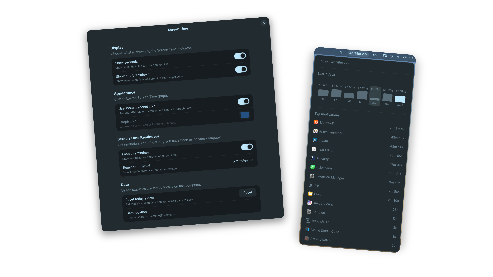

<p align="center">
  
</p>
<h3 align="center">Screen Time</h3>
<p align="center">GNOME extension to track your screen time and application usage</p>
  

  <h2>Quick Setup</h2>


```bash
git clone https://github.com/Hel1mo/screen-time.git
cd screen-time
make install
```
Log out and back in, then enable it on GNOME Extensions.

<h2>Features</h2>

- 🕒️ Track your daily screen time
- 📅 View your usage over the last 7 days
- 🖥️ See which applications you've used the most
- 🔔 Screen time reminders
- 🌈 Customise the graph colour
- 🖌️ Top bar customisation
- 🏠️ Usage data is stored locally


<h2>License</h2>
Distributed under the GNU General Public License. See `LICENSE.txt` for more information.
